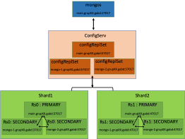

# GABD Practica 3. Bases de Dades no Relacionals i Distribuïdes
## Introducció
En aquesta pràctica treballarem amb bases de dades no relacionals (MongoDB) i construirem un sistema distribuït. A més, creareu vistes i analitzareu el rendiment de les consultes amb els plans d’execució. En concret, treballarem la replicació, sharding i  creació/eliminació/manipulació d’índexs i consultes en mongoDB amb una col·lecció de localitzacions geogràfiques (geonames ). Per fer-ho haureu de seguir les indicacions dels exercicis. 

## Arquitectura Distribuïda

Com es mostra a la Figura següent, l’arquitectura distribuïda en mongoDB, estarà formada per 3 elements: els shards, els servidors de configuració i el router. Els shards contenen una partició horitzontal de les dades i poden ser servidors MongoDB funcionant en mode standalone o replica sets. Els servidors de configuració són servidors MongoDB que contenen les metadades del sistema distribuït. En ells està tota la informació relacionada amb la organització de les dades (ells són qui saben en quin shard es troba cada fragment de dades). Finalment, el router (mongos) és l’encarregat de distribuir les transaccions entre els diferents shards i de recopilar la resposta per tornar-la a l’aplicació client que ha fet la petició.
MongoDB ens permet tenir funcionant més d’un servidor en una mateixa màquina. Només cal que especifiquem un directori on guardar els fitxers de dades (dbpath) i un port on escoltar les peticions. Aprofitarem aquesta característica per crear un sistema distribuït amb 9 servidors MongoDB sobre les 3 màquines de les que disposeu. L’arquitectura proposada és la següent: 
-	Un servidor mongos que s’executarà sobre la màquina main, i escoltarà pel port 27017.
-	2 shards. El primer shard, que anomenarem rs0, serà un replica set format per 3 nodes que escoltaran pel port 37017: un al main, un altre al mongo-1 i un altre al mongo-2. El segon shard, que anomenarem rs1, estarà format igualment per un replica set distribuït en les 3 màquines però escoltarà pel port 47017.
-	El servidor de configuració format per un replica set de 3 nodes: main, mongo-1 i mongo-2. I que escoltarà pel port 57017.

## Materials i Recursos
Per fer el lliurament d’aquest part disposeu de les indicacions d’aquest enunciat. A més, necessitareu un client de MongoDB per monitoritzar i configurar la base de dades. Us recomanem fer servir la versió gratuïtat de [noSQLBooster](https://nosqlbooster.com/downloads)  i Compass . Aquesta última és la GUI oficial de MongoDB i permet fer algunes tasques bàsiques amb MongoDB d’una manera molt fàcil i intuïtiva. La versió gratuïtat de noSQLBooster us permetrà fer en un entorn de finestres la totalitat dels exercicis.

Com en les pràctiques anteriors, caldrà que disposeu d’un client SSH per connectar-vos a les màquines de les pràctiques. En aquesta pràctica us haureu de connectar a les màquines main, mongo-1 i mongo-2. Totes 3 màquines tenen instal·lat un servidor de MongoDB on us podreu connectar al Shell de MongoDB amb la comanda pròpia: mongo. A més teniu instal·lada la comanda tmux , aquesta comanda permet obrir sessions en la terminal i recuperar-la en una nova sessió. És a dir, us permet entrar i sortir de la màquina main per ssh mantenint el que havia en la sessió anterior.

A més, disposeu dels notebooks de Colab que podeu executar allà o en local amb el servidor de Jupyter que us instal·leu en local. Aquests notebooks els trobareu a:
- [insertGeonames.ipynb](src/insertGeonames.ipynb). Us permetrà inserir les dades de [Geonames](http://download.geonames.org/export/dump/) a la base de dades.
- [testUCIMongoDB](src/testUCIMongoDB.ipynb). Forma part de la part opcional de la pràctica. Hareu de carregar les dades de la UCI que heu inserit a la base de dades d'Oracle i haureu de inserir els resultats en una col·lecció a MongoDB.

## Contacte
Per resoldre els dubtes i qüestions que pugueu tenir de la pràctica, podeu contactar als professors de l'assignatura:
- Oriol (oriol.ramos@uab.cat)
- Francis (franciscojavier.cobo@uab.cat)
